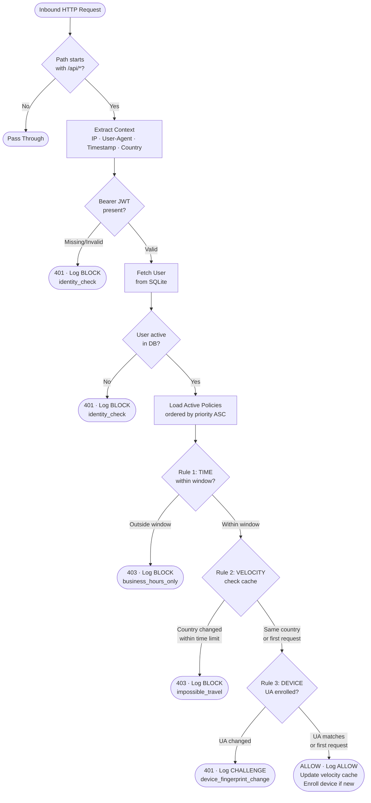

# Zero-Trust Adaptive API Gateway


---

## Elevator Pitch

Traditional API security asks *who are you?* — this system asks *does everything about this request make sense right now?*

This is a **Context-Based Access Control (CBAC) middleware** built on FastAPI that dynamically evaluates every inbound request across three independent threat dimensions — IP velocity, time-of-access, and device posture — making an autonomous allow/block/challenge decision in real time, before the request ever reaches protected business logic.

---

## The Security Problem This Solves

Standard token-based authentication (JWT, API keys) is binary: a valid token means access is granted. This model has a critical blindspot — **a stolen token from a legitimate user is indistinguishable from the legitimate user.**

CBAC addresses this by layering *context signals* on top of identity. A valid token from Tokyo at 3 AM, following a request from New York 30 seconds ago, from a different browser, is not a normal user. It is a compromised account. This gateway detects and blocks that scenario automatically.

---

## Core Features

### Threat Detection Engine

- **Impossible Travel Detection** — Resolves each request IP to a country via [ip-api.com](http://ip-api.com) and maintains a per-user velocity cache (simulating Redis). When a user's IP resolves to a different country within a configurable time window (default: 10 minutes), the request is blocked with `403 Forbidden`. A legitimate user cannot physically travel from New York to Tokyo in under 10 hours.

- **Device Posture Enforcement** — Fingerprints each user's User-Agent string on their first successful request. Every subsequent request is compared against the enrolled baseline. A sudden User-Agent change — indicative of session hijacking or credential stuffing — triggers an immediate `401 MFA Challenge`, forcing step-up authentication.

- **Time-Based Access Control** — Enforces configurable business-hour windows per policy. Access outside the permitted window returns `403 Forbidden`. All window parameters live in the database and can be updated at runtime without redeployment.

### Architecture & Engineering

- **Pure Policy Engine** — The core `evaluate_policies()` function is a side-effect-free, dependency-free pure function. It receives data in, returns a decision dict out. No database calls, no global state access. Fully unit-testable by passing plain Python dicts — no test fixtures or mocks required.

- **Append-Only Audit Trail** — Every evaluated request — whether allowed, blocked, or challenged — writes a row to the `access_logs` table. Identity failures (missing or invalid JWT) are also logged with `user_id=NULL`, so the audit trail has zero gaps. A blocked attacker cannot erase their footprint.

- **Priority-Ordered Policy Engine** — Rules are stored in SQLite and evaluated in ascending priority order. Policies can be enabled/disabled at runtime via the admin dashboard with no code changes or server restart required.

- **Real-Time Admin Dashboard** — A dark-mode Tailwind CSS dashboard served directly by FastAPI polls `/api/logs` every 2 seconds. New threat events animate in with colour-coded badges (green ALLOW, red BLOCK, amber CHALLENGE) and live stat counters, enabling instant situational awareness during a demo or incident.

- **Live Policy Control Panel** — Admin can toggle any CBAC rule on or off from the dashboard. The middleware re-fetches active policies on every request, so changes take effect immediately with no restart.

- **Traffic Simulator** — A companion `simulator.py` script generates realistic, weighted mixed traffic (normal requests, impossible travel attempts, device spoofing, unknown users) so the dashboard can be demonstrated live without manual curl commands.

---

## Architecture: Request Lifecycle



### Project Structure

```
cbac-project/
│
├── app/
│   ├── main.py          # FastAPI app — lifespan, middleware registration, routers
│   ├── engine.py        # Pure policy engine + geo-IP lookup + context extractor
│   ├── middleware.py    # CBAC orchestration — JWT, user lookup, enforce, audit
│   ├── database.py      # All SQLite helpers — schema, seed, queries
│   ├── auth.py          # JWT creation/verification + /auth/login endpoint
│   ├── config.py        # Pydantic settings (reads .env)
│   └── routes/
│       ├── protected.py # GET /api/payroll · GET /api/logs
│       └── admin.py     # GET /admin/dashboard · GET|PATCH /admin/policies
│
├── static/
│   └── login.html       # Login page served at /
│
├── dashboard.html        # Dark-mode Tailwind admin UI (2s polling, live badges)
├── simulator.py          # Weighted traffic generator for live demos
├── tests/
│   └── test_engine.py   # 20 unit tests — pure dicts, no fixtures, no DB
│
├── requirements.txt      # Pinned Python dependencies
├── Dockerfile            # Multi-stage build — secrets via env vars, not COPY
├── .env.example          # Environment variable template
└── cbac.db               # SQLite database (auto-created on first run, gitignored)
```

### Database Schema

```
users
  id · username · password_hash · last_user_agent · last_seen_ip · last_seen_at · is_active

access_policies
  id · policy_name · description · priority · rule_type · parameters (JSON) · action · is_enabled

access_logs
  id · timestamp · user_id · username · ip_address · country · city · action · policy_name · reason
```

Policies are stored as rows, not code. Changing the business-hours window from 9–17 to 8–18 is a single `UPDATE` statement.

---

## Quick Start

**Prerequisites:** Python 3.11+

### Step 1 — Clone and install dependencies

```bash
git clone https://github.com/your-username/cbac-project.git
cd cbac-project
pip install -r requirements.txt
```

### Step 2 — Configure environment

```bash
cp .env.example .env
# Edit .env and set JWT_SECRET to a long random string
```

### Step 3 — Start the gateway

```bash
uvicorn app.main:app --port 8000 --reload
```

The server will:
- Auto-create `cbac.db` with the three CBAC policies seeded
- Create two demo users: `demo` (password: `demo1234`) and `alice` (password: `alice1234`)
- Serve the login page at `http://localhost:8000/`
- Serve the admin dashboard at `http://localhost:8000/admin/dashboard`

### Step 4 — Run the traffic simulator (second terminal)

```bash
python simulator.py --port 8000
```

Then open the dashboard and watch the threat engine fire in real time.

```
http://localhost:8000/admin/dashboard
```

---

## Demo Credentials

| Username | Password   | Notes                                          |
|----------|------------|------------------------------------------------|
| `demo`   | `demo1234` | No enrolled device — first request enrolls UA  |
| `alice`  | `alice1234`| Pre-enrolled UA: `Mozilla/5.0 (Windows NT 10.0) TrustedBrowser/1.0` |

> **Note:** The business-hours policy (09:00–17:00) is enabled by default. If you're testing outside those hours, disable it from the admin dashboard at `/admin/dashboard` or toggle it off via `PATCH /admin/policies/1`.

---

## Manual Testing with curl

```bash
# 1. Get a token first
TOKEN=$(curl -s -X POST http://localhost:8000/auth/login \
  -H "Content-Type: application/json" \
  -d '{"username":"alice","password":"alice1234"}' | python -c "import sys,json; print(json.load(sys.stdin)['access_token'])")

# Normal request — expects 200 ALLOW
curl -H "Authorization: Bearer $TOKEN" \
     -H "User-Agent: Mozilla/5.0 (Windows NT 10.0) TrustedBrowser/1.0" \
     http://localhost:8000/api/payroll

# Impossible travel — pretend to come from Japan (alice was last seen locally)
curl -H "Authorization: Bearer $TOKEN" \
     -H "User-Agent: Mozilla/5.0 (Windows NT 10.0) TrustedBrowser/1.0" \
     -H "X-Forwarded-For: 103.5.140.1" \
     http://localhost:8000/api/payroll
# → 403: "Blocked: Impossible Travel Detected."

# Device spoofing — wrong User-Agent for enrolled alice
curl -H "Authorization: Bearer $TOKEN" \
     -H "User-Agent: EvilBot/3.0" \
     http://localhost:8000/api/payroll
# → 401: "Challenge: Unrecognized device. MFA Required."
```

---

## Running Tests

```bash
pytest tests/ -v
```

20 unit tests covering all three rule types, priority ordering, edge cases, and the default-allow path. No database or HTTP server required — all tests call `evaluate_policies()` directly with plain Python dicts.

---

## Docker

```bash
# Build
docker build -t cbac-gateway .

# Run — inject secrets via environment variables (never bake them into the image)
docker run -p 8000:8000 \
  -e JWT_SECRET=your-long-random-secret \
  -e DB_PATH=/data/cbac.db \
  -v $(pwd)/data:/data \
  cbac-gateway
```

---

## Design Decisions

| Decision | Rationale |
|---|---|
| Pure `evaluate_policies()` function | Enables unit testing without a database or HTTP server. Pass plain dicts, assert on the returned dict. |
| Cache updates only on ALLOW | Prevents a blocked attacker's forged location from becoming the trusted baseline — cache poisoning prevention by design. |
| Per-request SQLite connections | SQLite connections are not thread-safe. FastAPI dispatches middleware on a thread pool; a new connection per request is the safe default. |
| Append-only audit log | Security logs must be immutable. The table has no UPDATE or DELETE paths in application code. |
| `X-Forwarded-For` leftmost IP | In a proxy chain, only the leftmost IP is the original client. Downstream proxy IPs are controlled infrastructure and cannot be spoofed by the client. |
| Policy parameters as JSON in DB | Rules are data, not code. The time window, velocity threshold, and any future parameter can be tuned by an operator at runtime with no deployment. |
| Real geo-IP (ip-api.com) | Free, no API key required. Results cached in memory for 1 hour. Private/loopback IPs resolve instantly to a local placeholder with no network call. |

---

## Extending the System

The gateway is intentionally designed for extension at clean seams:

- **Add a new rule type** — Add a row to `access_policies` with a new `rule_type` value, then add one `elif` branch in `evaluate_policies()`. The middleware, logging, and dashboard require zero changes.
- **Real Redis** — Replace `user_location_cache: dict` in `engine.py` with a `redis.Redis` client. The cache read/write interface in the middleware is already isolated to two lines.
- **Real geo-IP (MaxMind)** — Replace `lookup_geo()` in `engine.py` with a call to MaxMind GeoLite2. The rest of the system is unchanged.
- **Per-user policies** — Add a `user_id` FK to `access_policies` and filter the policy query by user. The engine receives a list and doesn't care where it came from.

---

## Tech Stack

| Layer | Technology |
|---|---|
| API Framework | FastAPI 0.115 |
| ASGI Server | Uvicorn |
| Database | SQLite 3 (via aiosqlite) |
| Velocity Cache | Python `dict` (Redis-compatible interface) |
| Geo-IP | ip-api.com (free tier, cached in-memory) |
| Dashboard | Tailwind CSS 3 (CDN) + Vanilla JS |
| Auth | python-jose (JWT HS256), passlib/bcrypt |
| HTTP Client (simulator) | requests |
| Tests | pytest |


